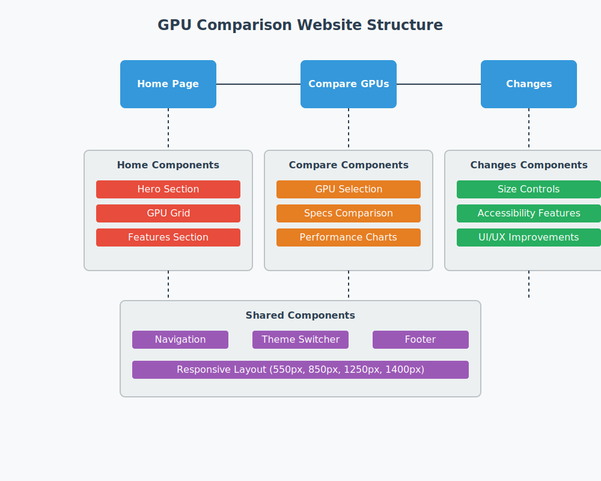

# 🎮 Porovnávací Systém GPU

## 📝 Popis Projektu
Interaktívna webová stránka vyvinutá v rámci zadania WT 2024, zameraná na porovnávanie grafických procesorov (GPU). Projekt kladie dôraz na responzívny dizajn, prístupnosť a používateľskú prívetivosť.



## 🎯 Cieľ Projektu
Hlavným cieľom projektu je vytvoriť komplexný systém na porovnávanie GPU s dôrazom na:
- Responzívny dizajn pre rôzne zariadenia
- Optimalizáciu používateľského rozhrania
- Prístupnosť pre hendikepovaných používateľov
- Implementáciu moderných webových technológií

## 🚀 Kľúčové Funkcie
### Porovnávanie GPU
- Detailné porovnanie špecifikácií
- Interaktívne výkonnostné grafy
- Cenové porovnanie
- Analýza pomeru výkon/cena

### Prispôsobiteľné Rozhranie
- Tmavý/Svetlý režim
- Nastaviteľná veľkosť obsahu
- Tri spôsoby zmeny veľkosti:
  * Tlačidlá
  * Klávesové skratky
  * Rozbaľovací zoznam

### Prístupnosť
- Podpora čítačiek obrazovky
- Klávesová navigácia
- Vysoký kontrast
- Prispôsobiteľná veľkosť textu

## 🛠 Použité Technológie
### Frontend
- HTML5
- CSS3 (Flexbox + Grid)
- JavaScript
- Bootstrap 5
- Chart.js

### Nástroje pre Vývoj
- Visual Studio Code
- Git
- Chrome DevTools
- Figma (pre wireframes)

## 📱 Podporované Rozlíšenia
Stránka je optimalizovaná pre nasledujúce rozlíšenia:
1. **Mobilné zariadenia**
   - Do 550px
   - Prispôsobené rozloženie
   - Zjednodušená navigácia

2. **Tablety**
   - Do 850px
   - Hybridné rozloženie
   - Optimalizované menu

3. **Desktopy**
   - Do 1250px
   - Plné rozloženie
   - Rozšírené funkcie

4. **Veľké Obrazovky**
   - Do 1400px
   - Maximálne využitie priestoru
   - Multi-kolónkové zobrazenie

## 📂 Štruktúra Projektu
```
📦 GPU-Comparison-Project
 ┣ 📂 css
 ┃ ┗ 📜 style.css                 # Hlavný CSS súbor s media queries
 ┣ 📂 js
 ┃ ┣ 📜 bootstrap.bundle.js       # Bootstrap JavaScript
 ┃ ┣ 📜 chart.js                  # Grafy a vizualizácie
 ┃ ┣ 📜 gpu-comparison.js         # Logika porovnávania
 ┃ ┣ 📜 loadCSS.js               # Načítanie CSS súborov
 ┃ ┣ 📜 resize.js                # Zmena veľkosti obsahu
 ┃ ┗ 📜 responsive.js            # Responzívne funkcie
 ┣ 📂 optimization
 ┃ ┗ 📂 wireframes               # Wireframes a návrhy
 ┃   ┣ 📜 changes-wireframe.svg
 ┃   ┣ 📜 comparison-wireframe.svg
 ┃   ┣ 📜 homepage-wireframe.svg
 ┃   ┗ 📜 structure-diagram.svg
 ┣ 📜 changes.html               # Stránka zmien
 ┣ 📜 index.html                 # Hlavná stránka
 ┣ 📜 sub.html                   # Stránka porovnania
 ┗ 📜 README.md
```

## 📑 Popis Stránok
### 1. Hlavná Stránka (index.html)
- Využíva Grid Layout
- Zobrazenie dostupných GPU
- Rýchly prístup k porovnaniu
- Responzívny dizajn

### 2. Porovnávacia Stránka (sub.html)
- Postavená na Bootstrap 5
- Interaktívne porovnanie
- Výkonnostné grafy
- Detailné špecifikácie

### 3. Stránka Zmien (changes.html)
- Sekcia "sekcia_zmena"
- Ovládanie veľkosti obsahu
- Informácie o vylepšeniach
- Prístupové funkcie

## ⚙️ JavaScript Funkcionalita
### loadCSS.js
```javascript
// Načítanie CSS súborov podľa rozlíšenia
function loadCSSForResolution() {
    // Implementácia
}
```

### resize.js
```javascript
// Zmena veľkosti obsahu
class ContentResizer {
    // Implementácia
}
```

### responsive.js
```javascript
// Responzívne funkcie
class ThemeManager {
    // Implementácia
}
```

## 🎨 CSS Implementácia
### Media Queries
```css
/* Mobilné zariadenia */
@media (max-width: 550px) {
    // Štýly
}

/* Tablety */
@media (max-width: 850px) {
    // Štýly
}

/* Desktopy */
@media (max-width: 1250px) {
    // Štýly
}

/* Veľké obrazovky */
@media (max-width: 1400px) {
    // Štýly
}
```

## ⌨️ Klávesové Skratky
- `Shift + 1`: Malá veľkosť textu
- `Shift + 2`: Stredná veľkosť textu
- `Shift + 3`: Veľká veľkosť textu

## 🔍 Optimalizácia
### Výkon
- Optimalizované obrázky
- Minimalizované CSS a JS
- Efektívne načítanie zdrojov
- Cachovanie používateľských nastavení

### SEO
- Sémantické HTML
- Meta tagy
- Štruktúrované dáta
- Optimalizované nadpisy

### Prístupnosť
- ARIA atribúty
- Klávesová navigácia
- Alternatívne texty
- Kontrastné farby

## 🛡️ Bezpečnosť
- Validácia vstupov
- XSS ochrana
- CSRF ochrana
- Bezpečné načítanie zdrojov

## 📊 Funkcie Porovnávania GPU
### Podporované Metriky
- Výkon v hrách
- Výkon v renderovaní
- Energetická efektivita
- Teplotné charakteristiky

### Vizualizácie
- Výkonnostné grafy
- Porovnávacie tabuľky
- Radarové diagramy
- Teplotné mapy

## 🔄 Verzia a Aktualizácie
- Verzia: 1.2
- Posledná aktualizácia: November 2024
- Stav: Pripravené na použitie

## 👥 Autori
- Daniel Sisák
- Hryshyn Mykyta
- Samuel Furda
- Viktor Olšavský

## 📋 Požiadavky Projektu
Projekt bol vyvinutý v súlade s požiadavkami zadania WT 2024:
1. Trojstránková webová stránka
2. Využitie HTML5, CSS3 a JS
3. Optimalizácia UX/UI
4. Implementácia frameworku
5. Sekcia zmien
6. Responzívny dizajn

## 🎓 Akademické Využitie
Projekt je vytvorený pre akademické účely a demonštruje:
- Moderné webové technológie
- Responzívny dizajn
- Prístupnosť
- Interaktívne funkcie

## 📄 Licencia
Tento projekt je akademickou prácou a je chránený autorskými právami.

---
Vytvorené pre predmet Webové Technológie 2024 ❤️